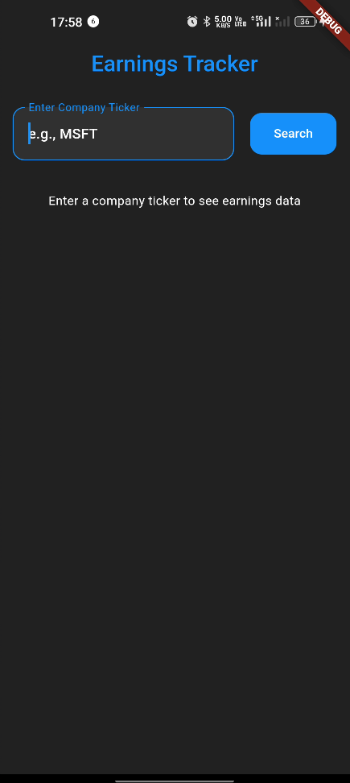
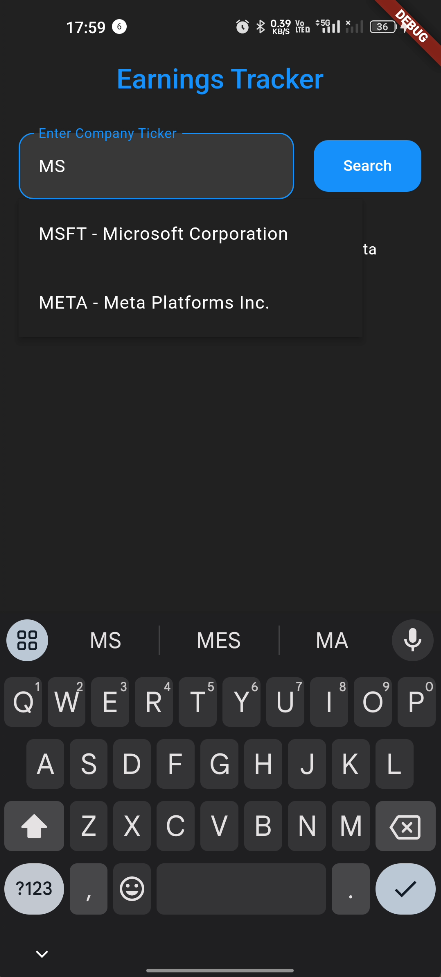
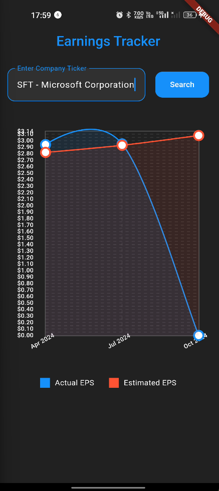
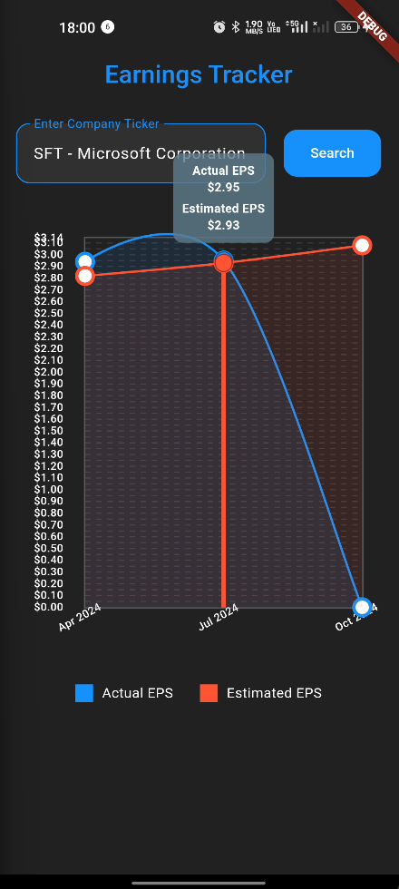

# Earnings Tracker
[](https://flutter.dev/)
[](https://dart.dev/)

A Flutter application that allows users to track and analyze company earnings data, including estimated vs actual earnings comparisons and earnings call transcripts.

## Features

- 📈 Real-time earnings data tracking
- 🔍 Company search with autocomplete
- 📊 Interactive earnings comparison graph
- 📝 Access to earnings call transcripts
- 🌓 Light/Dark theme support
- 🎯 Clean architecture implementation

## Screenshots

<table>
  <tr>
    <td></td>
    <td></td>
    <td></td>
    <td></td>
  </tr>
  <tr>
    <td></td>
  </tr>
</table>


## Tech Stack

- **Framework**: Flutter
- **State Management**: Flutter Bloc
- **Architecture**: Clean Architecture
- **API Integration**: http package
- **UI Components**: Material Design 3

## Dependencies

```yaml
dependencies:
  flutter:
    sdk: flutter
  flutter_bloc: ^8.1.3
  http: ^1.1.0
  equatable: ^2.0.5
  dartz: ^0.10.1
  get_it: ^7.6.4
  iconly: ^1.0.1
  fl_chart: ^0.36.1
```

## Project Structure

```
lib/
├── core/
│   ├── error/
│   ├── api_constants.dart
│   ├── theme.dart
│   └── usecase.dart
├── features/
│   ├── data/
│   │   ├── datasources/
│   │   ├── models/
│   │   └── repositories/
│   ├── domain/
│   │   ├── entities/
│   │   ├── repositories/
│   │   └── usecases/
│   └── presentation/
│       ├── bloc/
│       ├── pages/
│       └── widgets/
├── injection_contatiner.dart
└── main.dart

```

## Getting Started

### Prerequisites

- Flutter SDK (latest version)
- Dart SDK (latest version)
- API Key from api-ninjas.com

### Installation

1. Clone the repository
```bash
git clone https://github.com/SanjayKParida/stock-screener.git
```

2. Navigate to project directory
```bash
cd stock-screener
```

3. Install dependencies
```bash
flutter pub get
```

5. Run the app
```bash
flutter run
```

## API Integration

The app uses two main endpoints from api-ninjas.com:
- Earnings Calendar API
- Earnings Call Transcript API

Make sure to sign up for an API key at [api-ninjas.com](https://api-ninjas.com)

## Usage

1. Launch the app
2. Enter a company ticker or name in the search field
3. Select from autocomplete suggestions or press search
4. View the earnings comparison graph
5. Click on data points to access earnings call transcripts

## Contact

Your Name - [@Sanjay K. Parida](https://www.linkedin.com/in/sanjay-kumar-parida/)

Project Link: [https://github.com/SanjayKParida/stock-screener](https://github.com/SanjayKParida/stock-screener)